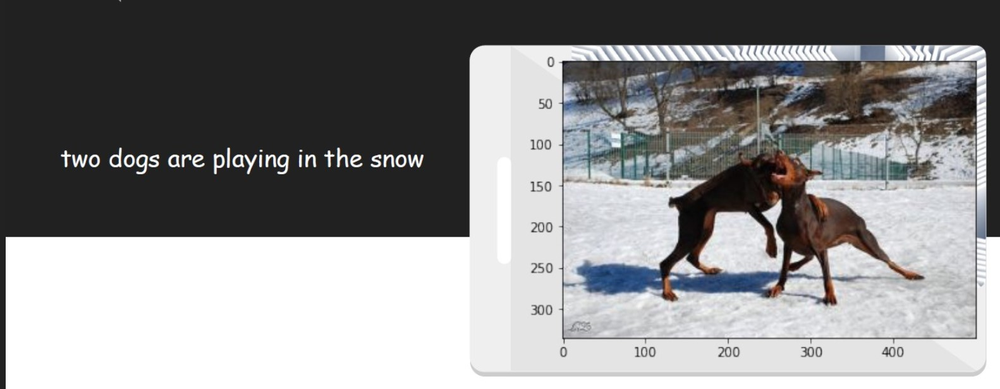

# Image-Captioning
The Image Captioning project deals is an innovative and enhanced Deep Learning Model that utilises the concepts of Computer Vision, Word Embedding and Convolutional Neural
Networks to automatically generate suitable and apt captions for input images. We Used ResNet50 model to extract features from the images and LSTM to encode linguistic features and generate word sequences based on the image features.

# Sample Prediction 
Here is a sample prediction

